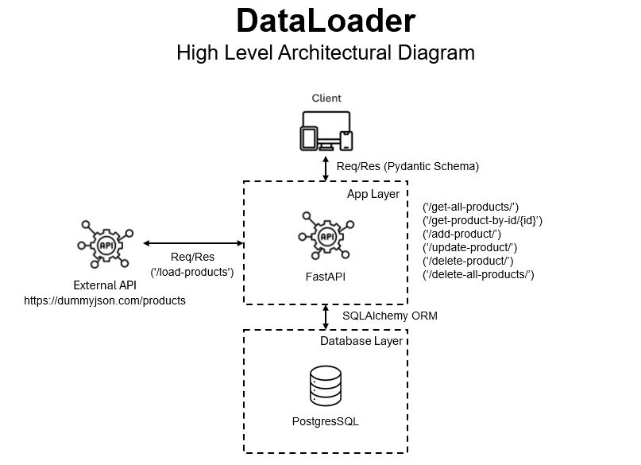

This repo contains source code for dataloader, a fastAPI app



## Table of Contents

- [Instructions](#Instructions)
- [App Structure](#AppStructure)
- [Features](#Features)

## Instruction

- setup folder, readme, .env and .gitignore
- install virtualenv
  - python -m venv myenv
- myenv\Scripts\Activate.ps1 / source myenv/bin/activate
  - ensure python interpretoer is now pointing to myenv
- install required packages
  - pip install python-dotenv
  - pip install fastapi
  - pip install uvicorn
  - pip install sqlalchemy psycopg2-binary
  - pip install requests
- run server
  - uvicorn main:app --reload

## App Structure

```
app/
├── main.py # FastAPI app and routes (entry point)
├── database.py # DB connection setup (SQLAlchemy engine & session)
├── models.py # SQLAlchemy ORM models (table definitions)
├── schemas.py # Pydantic models for request/response validation
└── crud.py # CRUD functions (create/read/update/delete)
```

## Features

- Load data from external API
- Add data
- Get data
- Get data by id
- Update data by id
- Delete all data
- Delete data by id
